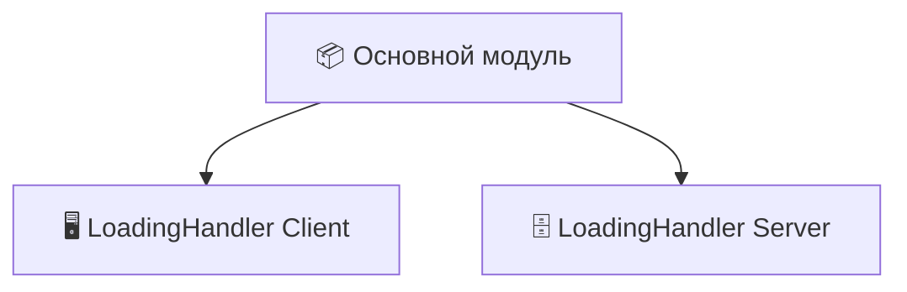
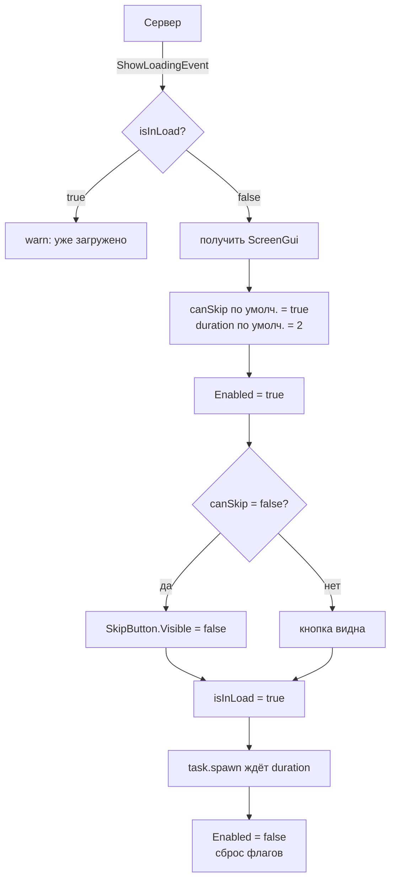
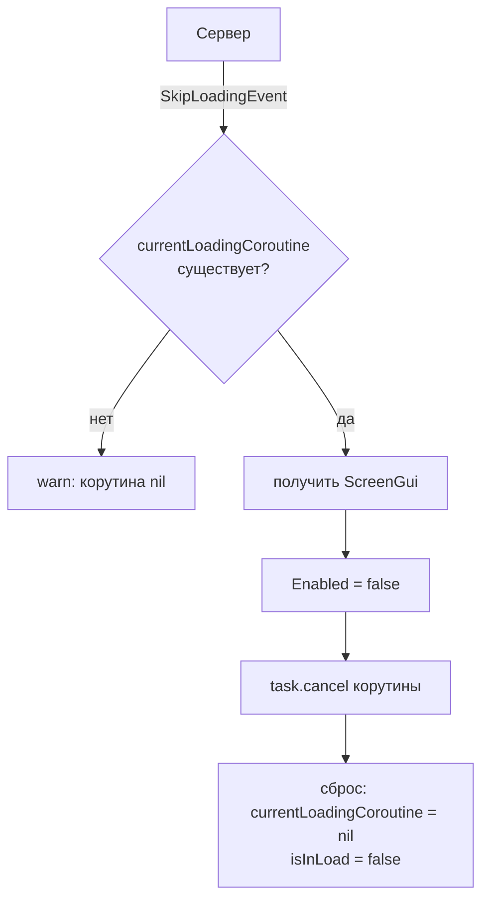

> Модуль предназначен для **отправки игроку окон загрузки (GUI)**.  
Простыми словами — при входе в игру (как в любом современном проекте) появляется gui загрузки.  
Но этим возможности не ограничиваются — модуль позволяет **вызывать загрузку в любой момент**, например:

- 🔄 **Смена уровней** (переход между локациями)
- 🌐 **Загрузка на другой сервер** (бесшовный редирект)
- 🛒 **Открытие магазина** (пока грузится ассортимент)
- ⚙️ **Любые другие процессы** (API, генерация мира, проверка лицензии…)

## 📦 Зависимости модуля

Для работы необходимы две части — клиентская и серверная.  
Они общаются между собой, обеспечивая плавное отображение загрузок.




## LoadingHandler (Client)

> Модуль, который управляет отображением **любых загрузочных экранов** на клиенте.  
Слушает события сервера, не допускает наслоения, автоматически скрывает экран, учитывает право на пропуск.


#### Структура screenGui

```
StarterGui
│
└── Loading                     // Папка, где хранятся все загрузочные экраны
    │
    ├── LevelLoading            // Пример экрана (ScreenGui)
    │   ├── ...
    │   └── SkipButton          // Кнопка пропуска (опционально)
    │       └── LocalScript     // Скрипт кнопки (см. ниже)
    │
    └── StoreLoading            // Другой экран
        └── ...
```


> [!IMPORTANT]  
> <b>Правила для экрана загрузки:</b>
>- Это **ScreenGui**, лежащий **прямо в папке `Loading`**.
>- Если нужна кнопка пропуска, она должна быть **непосредственным потомком ScreenGui** (не внутри фреймов).
>- Имя кнопки — **`SkipButton`** (строго, так ищет код).

## ✅ Важные особенности работы

| Параметр     | Тип       | Обязательный | По умолчанию | Описание                             |
| ------------ | --------- | ------------ | ------------ | ------------------------------------ |
| `screenName` | `string`  | ✅ Да         | –            | Имя ScreenGui в `StarterGui.Loading` |
| `duration`   | `number`  | ❌ Нет        | `2` секунды  | Через сколько закроется сама         |
| `canSkip`    | `boolean` | ❌ Нет        | `true`       | Можно ли пропустить кнопкой          |
> [!WARNING]  
**Важно:**
>- Кнопка должна называться **строго `SkipButton`** (с заглавной S и B).
  >  
>- Имя экрана (`screenName`) должно **точно совпадать** с именем ScreenGui в `StarterGui.Loading`.
>- Если `canSkip = false`, но кнопка не найдена — ничего страшного, просто не будет кнопки.

## 🔄 Схемы взаимодействия
### 📤 Схема A – Показ загрузки (`ShowLoadingEvent`)

### 🎯 Схема B – Пропуск загрузки (`SkipLoadingEvent`)

## ✅ Важные особенности работы

| 🧩 Что                       | ⚙️ Как работает                                                                                  |
| ---------------------------- | ------------------------------------------------------------------------------------------------ |
| 🚫 **Блокировка наслоения**  | `isInLoad` не позволяет показать второй экран, пока первый не закрыт                             |
| ⏱️ **Авто-закрытие**         | Запускается корутина на `duration` секунд, после чего `Enabled = false`                          |
| 👁️ **Пропуск (skip)**       | Если `canSkip = false`, кнопка `SkipButton` становится **невидимой** (даже если она есть в GUI)  |
| ✋ **Ручное закрытие**        | Сервер вызывает `SkipLoadingEvent` → клиент закрывает текущий экран и отменяет таймер            |
| 🔄 **Значения по умолчанию** | `duration = 2`, `canSkip = true`                                                                 |
| 🔍 **Поиск экрана**          | `getLoadingScreenGui` использует `WaitForChild` — дождётся появления, если экран ещё не загружен |
## 🚀 Готово к использованию
Скопируй скрипт ниже для кнопки и помести в нее, название не имеет значение (но я прошу тебя называть SkipScript)

```lua

-- Services
local ReplicatedStorage = game:GetService("ReplicatedStorage")


-- Remotes
-- Events
local EventsFolder = ReplicatedStorage.Remote.Event.Loading
local SkipLoadingEvent: RemoteEvent = EventsFolder.SkipLoadingEvent


-- Values
local button = script.Parent
local screenGuiName = button.Parent.Name

button.MouseButton1Click:Connect(function()
	SkipLoadingEvent:FireServer(screenGuiName)
end)
```

> [!NOTE]  
Кнопка отправляет на сервер **имя своего родительского ScreenGui**.  
Сервер уже сам решает, можно ли скипнуть, и вызывает `SkipLoadingEvent` на клиенте.